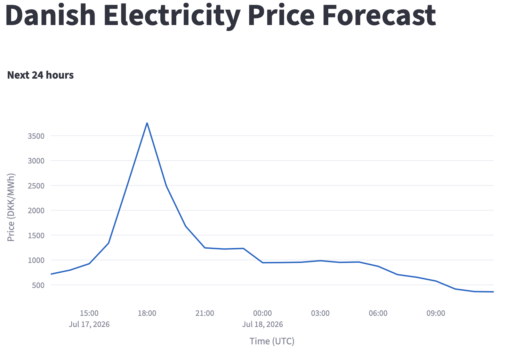

# Danish Electricity Price Forecaster


This system predicts Danish day-ahead electricity prices using weather data as the primary signal. Because Denmark's grid is heavily wind-powered, wind speed is a strong predictor of supply - and therefore price. The system ingests live wind observations and historical spot prices, trains a forecasting model, and serves predictions via a REST API with a live dashboard showing the next 24 hours.


## Results
The model achieves a MAE of 210 DKK/MWh compared to a naive baseline of 328 DKK/MWh (predicting the mean price every hour). This represents a 36% improvement, meaning the model is on average 118 DKK/MWh closer to the actual price than simply guessing the average. For context, a typical Danish household consumes 1-2 kWh per hour, so the model's error translates to roughly 0.21-0.42 DKK per hour of consumption.



## Architecture
```
DMI Weather API ──┐
                  ├──► ingest.py ──► features.py ──► train.py ──► MLflow
Energi Data  ─────┘                                      │
Service API                                               ▼
                                                   serve/app.py (FastAPI)
                                                          │
                                                          ▼
                                                 dashboard/app.py (Streamlit)
```

Pipeline steps:

- Ingest — fetches live wind observations (DMI) and spot prices (Energi Data Service)
- Features — builds hourly feature matrix including price lags (24h, 48h, 168h), rolling averages, wind speed, and calendar features (hour, day of week, weekend)
- Train — LightGBM regressor trained on 90 days of data with time-series train/test split. Experiments tracked with MLflow
- Serve — FastAPI endpoint returns 24-hour price forecast as JSON
- Dashboard — Streamlit frontend displays interactive forecast chart


## How to run
How to run
1. Clone the repo
```bash
git clone https://github.com/carlemil112/dk-power-forecast.git
cd dk-power-forecast
```

2. Install dependencies
```bash
pip install -r requirements.txt
```

3. Fetch data
```bash
python ingest.py
```
4. Build features
```bash
python features.py
```

5. Train the model
```bash
python train.py
```

6. Start the API
```bash
uvicorn serve.app:app --reload
```

7. Start the dashboard (new terminal tab)
```bash
streamlit run dashboard/app.py
```
Open http://localhost:8501 in your browser.

## Tech stack
- **LightGBM** — gradient boosting model for tabular time-series forecasting
- **MLflow** — experiment tracking and model registry
- **FastAPI** — REST API serving the forecast endpoint
- **Streamlit** — interactive dashboard frontend
- **Pandas** — data manipulation and feature engineering
- **Plotly** — interactive forecast chart
- **Energi Data Service** — Danish day-ahead electricity price data
- **DMI Open Data** — Danish weather observations (wind speed)